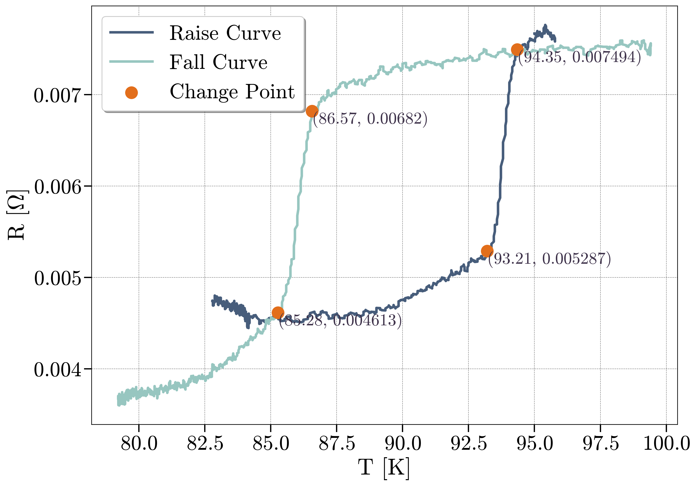
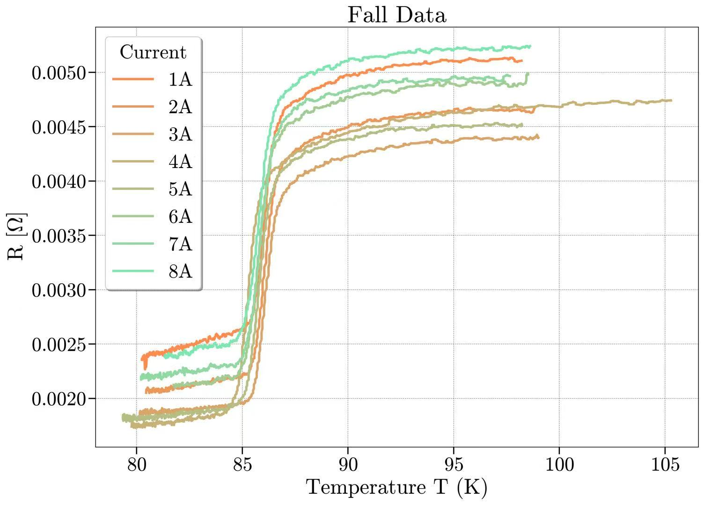
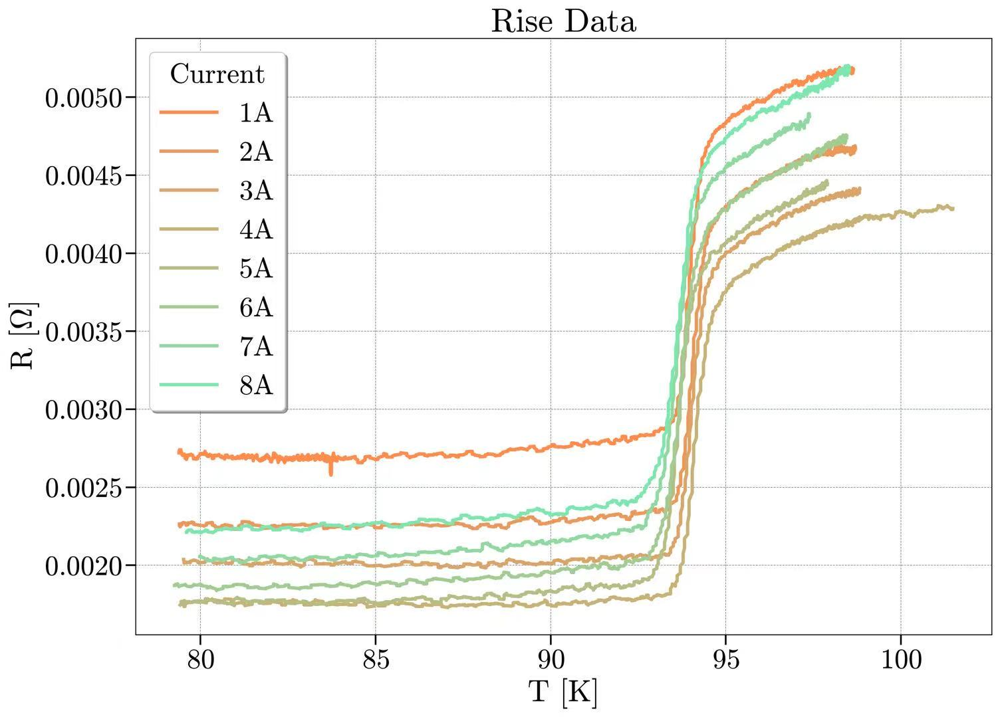
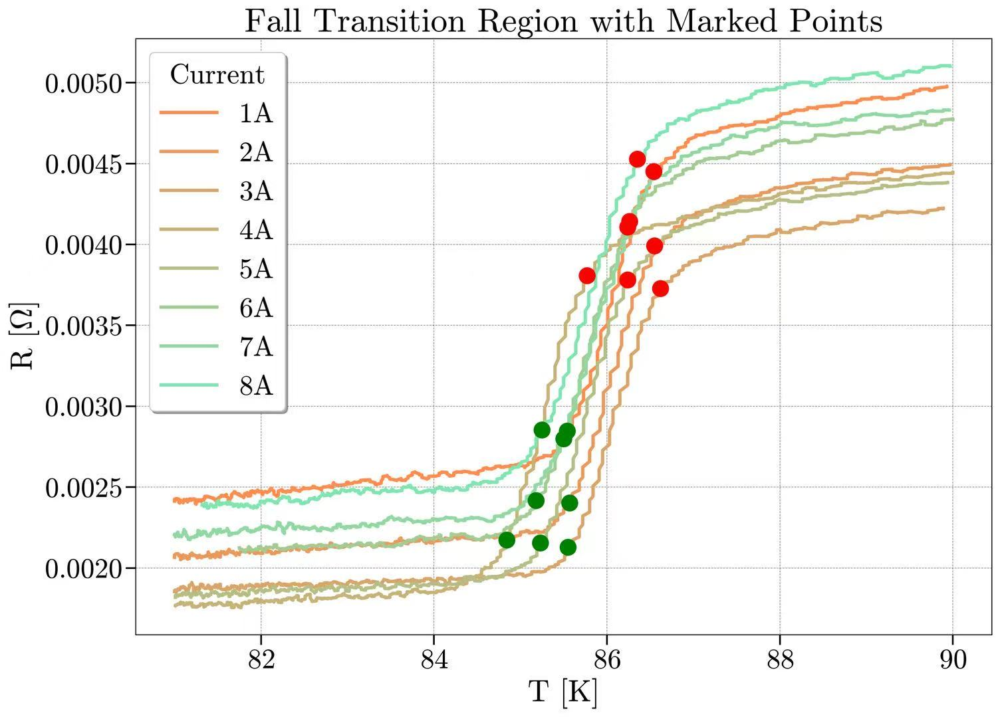
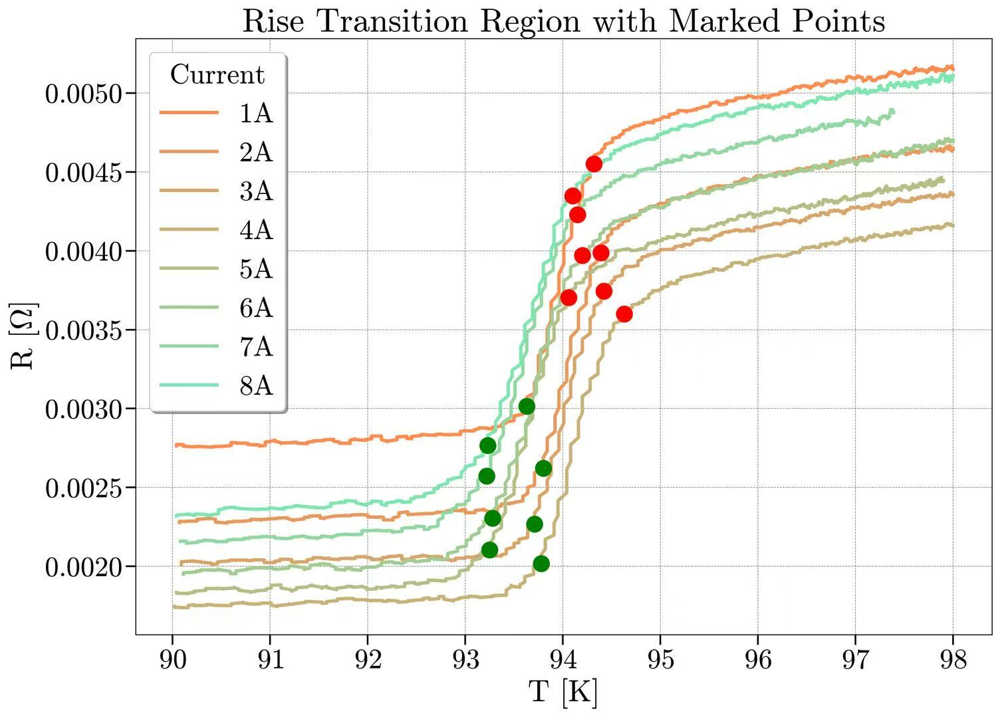
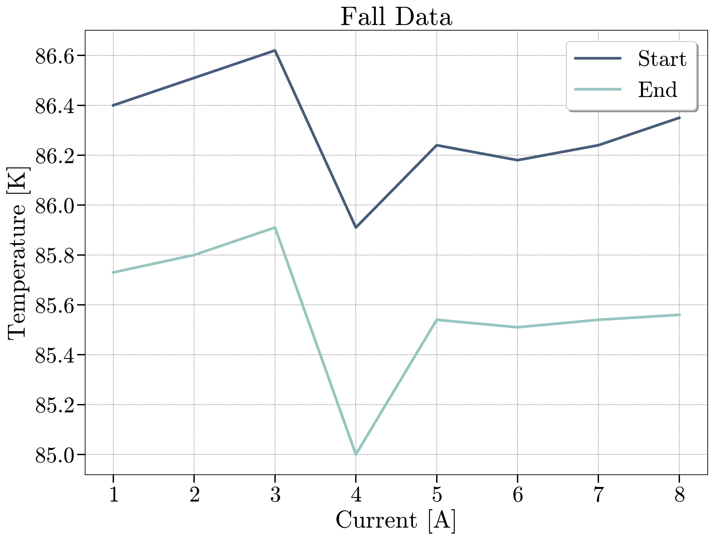
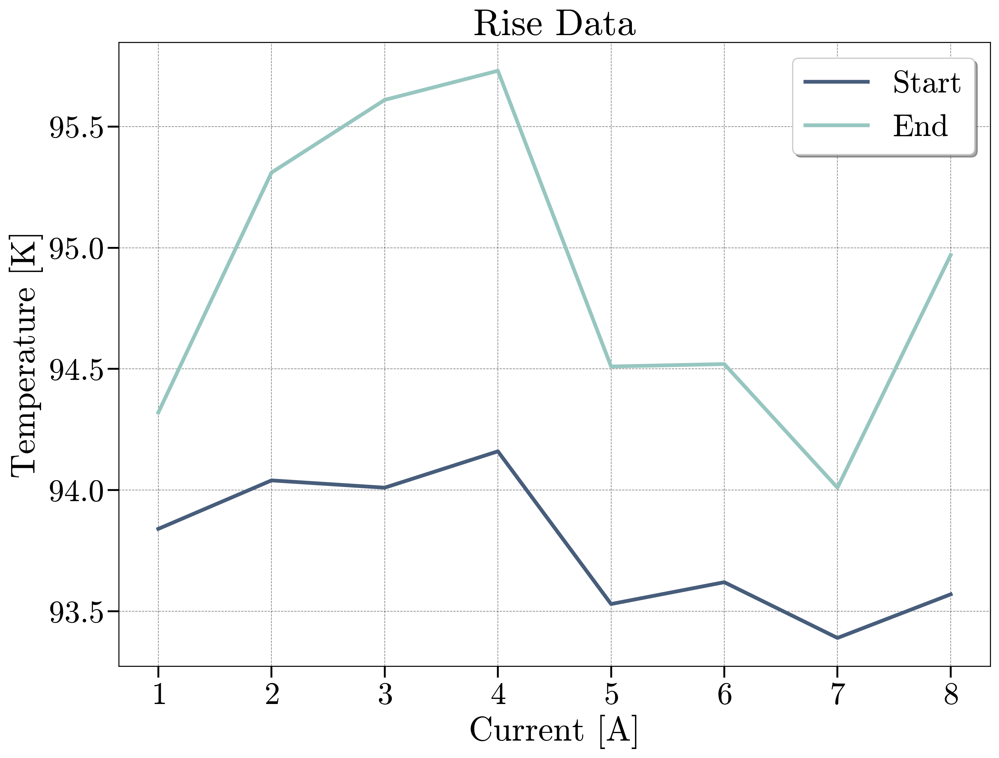

# E1实验报告数据分析

## day1

第一周实验中，我们的重点是熟悉仪器，同时测量了一组数据，即“样本在温度升高和降低的条件下的电阻值”。数据绘制的图像如上图所示。

可以发现，在升温过程中，温度在93.21K时，电阻值发生明显的转变，在94.35K时，电阻值转变开始趋于平缓；在降温过程中，温度在86.57K时，电阻值发生明显转变，在85.28K时，电阻值转变开始趋于平缓。

上面的实验数据说明，该样品在85K-94K存在超导转变现象。

值得注意的是，升温过程的转变温度与降温过程的转变温度相差有8K，显然在温度的测量中应该存在误差，这在后面再进行更详细的讨论。

## day2

在第二周的实验中，我们探究了被测样品在不同大小的外加磁场对样品转变温度的影响。实验数据的绘制图像如下所示。

我们将电阻值转变的部分截取出来，并标记出电阻值开始明显变化的点，如下所示。

上两张图分别展示的是样品在降温和升温过程的转变温度与线圈电流的关系。

从图中可以看出，该样品的转变温度变化对外磁场并不敏感，转变温度的上下波动更多的是测量误差。

## 可讨论的问题

温度的测量：理论上，我们预期的结果应该是，不论是升温过程还是降温过程，都有相同的转变温度；但是实际实验的测量结果显示，升温过程的转变温度为94K左右，降温过程的转变温度为86K左右，相差8K，这已经超出了简单的“测量误差”的接受范围。

一个可能的原因是温度传感器的温度并未真实的反应样品的温度，而是存在一个滞后。在我们的实验中，升温与降温采用动态法测量，，温度变化速率不同，导致样品与温度计的温度响应存在差异。升温时，温度计显示温度比样品实际温度高，测得转变温度偏高；降温时，温度计显示温度比样品实际温度低，测得转变温度偏低。一个改进的方向是，降低温度变化的速率，让被测样品与温度传感器之间达到热平衡，以此测得更准确的温度。

电阻的测量：理论上，我们应当预期在超导转变前后，样品具有相同的电阻值；但是测量结果显示，在反复测量的过程中，测量得到的电阻值存在较大的波动。

可能的原因是，我们所使用的压控电流源并不稳定，这会导致锁相放大器所测量得到的电压值也不稳定，造成较大的波动。

另一个可能的原因是，样品中可能存在温度梯度，会产生热电效应，导致额外的电压或电流，从而影响测量结果。