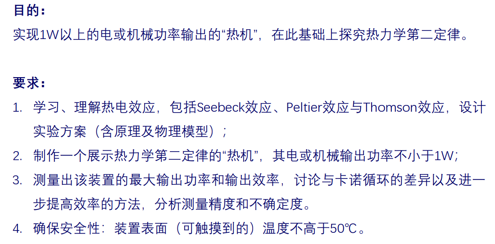
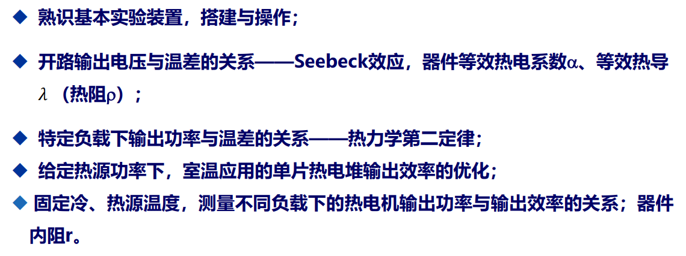
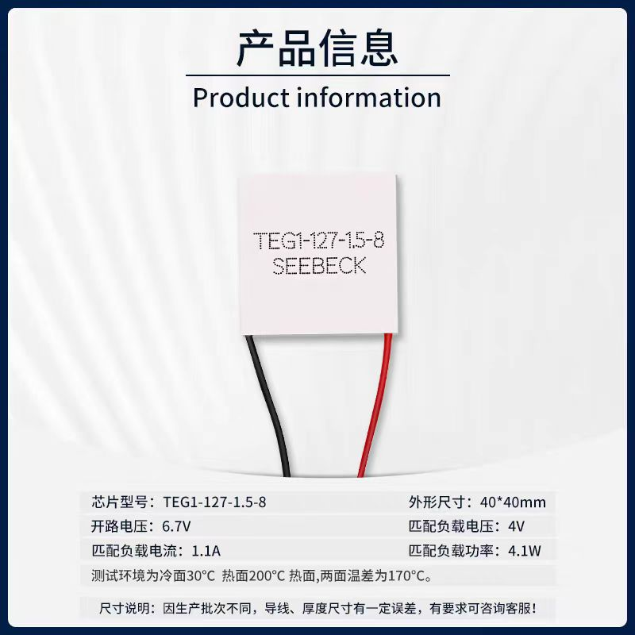
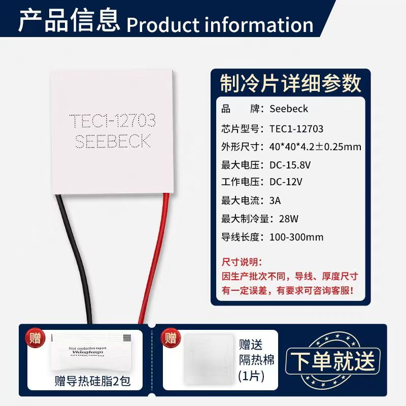

# 设计性实验大纲

## 回顾实验要求

## 介绍三种热电效应（Seebeck,Peltier,Thomson）
1. Seebeck效应
$V=\alpha\cdot\Delta T$，$\alpha$为Seebeck系数
        
2. Peltier效应
$\dot{Q}=\Pi \cdot I$，$\Pi$为Paltier系数
3. Thomson效应
$\dot{Q}=\mu I\cdot \nabla T$，$\mu$为Thomson系数

## 热机的搭建

- 热端：电热贴加热（通过控制电压、电流实现功率的控制）
- 中间核心元件：

- 冷端：风扇散热（有优化空间）
- 外围：用隔热材料覆盖，确保热量尽量全部流入Seebeck元件。
- 冷端、热端使用PID控温
- 负载：没想好

## 实验目的

- 验证热力学第二定律
- 测量最大输出功率
- 测量最大输出效率
- 测量Seebeck系数$\alpha$
- 测量Seebeck元件的转换效率

## 实验方案

### 简化考虑

**基本假设：忽略系统对空气的散热，则电热贴的发热全部被Seebeck元件吸收。**

在上述假设下，进行下面的实验：
1. 验证热力学第二定律
在冷端和热端温度都确定的情况下，测量其输出效率$\eta=\frac{W_{对外做功}}{Q_{吸热}}=\frac{P_{对外做功功率}}{P_{电热贴发热功率}}$
原则上最大输出效率为卡诺热机效率$\eta_c=1-\frac{T_c}{T_h}$
只需验证$\eta<\eta_c$即可

2. 测量最大输出功率
原则上，当热机的等效内阻与负载的内阻满足$R_{热机}=R_{负载}$时，可以达到输出功率最大。

3. 测量最大输出效率
通过改变温差或负载，测量不同条件下的输出效率。
4. 测量Seebeck系数$\alpha$
测量不同温差下的输出电动势，再线性拟合。
5. 测量Seebeck元件的转换效率。
即测量Seebeck的输出功率和电热贴的发热功率之比$\eta=\frac{P_{Seebeck元件输出功率}}{P_{电热贴发热功率}}$

### 提升（优化）

- 优化冷端的散热方式，由原先的风扇散热变成使用Paltier元件。

- 测量（估算）热对空气的耗散
    1. 热对流：使用牛顿冷却定律（$\dot{Q}=hA(T_{surface}-T_{air})$），A为面积。
    2. 热辐射：使用斯特藩-玻尔兹曼定律（$\dot{Q}=\epsilon\sigma A(T^4_{surface}-T^4_{air})$），A为面积。
基于上面的估算，再修正之前的计算。
<!-- - 完成一个Labview程序，实现自动测量 $E(T_h,T_c)$ 和 $r(T_h,T_c)$ -->

