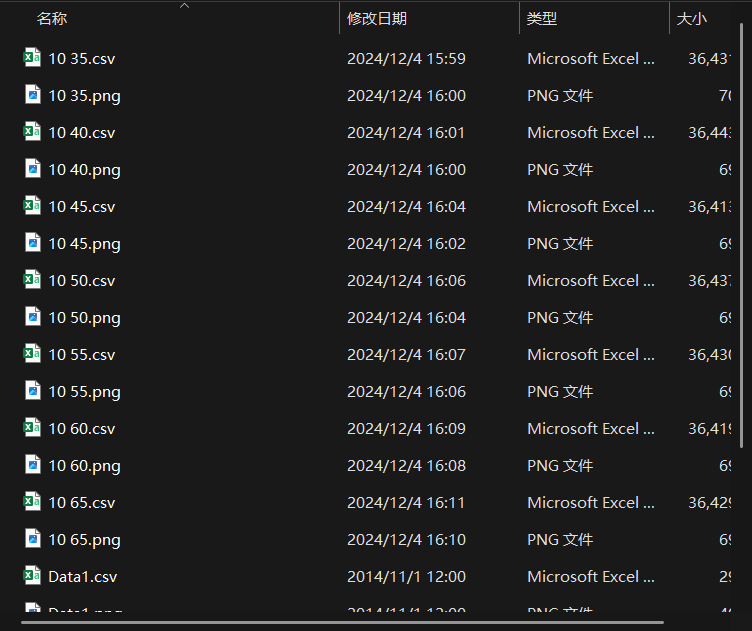

# 实验数据解释

我们一共有5个shutter，相关数据均存储在**shutter-i**文件夹中。

**两个old文件夹中的数据作废**

文件名的前一个数字 **10** 表示当前工作的频率，不重要；后一个数字表示当前工作的电压值 **$u \times 0.1 V$**

# 需求

- 对每个快门在不同电压下的上升时间和下降时间做分析并作图。
- 找到性能最相匹配的两个快门（或多个快门）以及其对应工作电压。